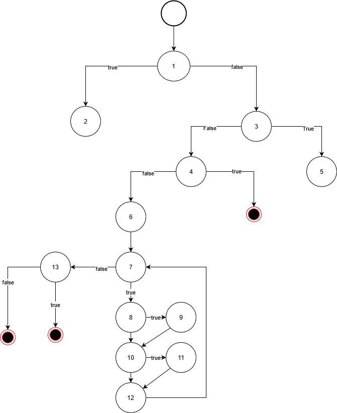

# Втора лабораториска вежба по Софтверско инженерство

## Маријана Милковска, бр. на индекс 143068

### Група на код: 

Ја добив групата на код 2

###  Control Flow Graph

Фотографија од control flow graph-от

### Цикломатска комплексност

Цикломатската комплексност на код 2 изнесува 12, тоа е добиено формулата: E - N + 2 * P, каде што E е бројот на линии, N е бројот на јазли, а бројот P е бројот на јазли кои што претставуваат излез од програмата.
Според тоа:

- E = 19
- N = 13
- P = 3

19 - 13 + 2 * 3 = 12

### Тест случаи според критериумот  Every branch 

1.Кога корисникот има невалиден username и email

2.Кога корисникот има валиден username и email

### Тест случаи според критериумот Multiple Condition

1. Четири случаи со невалиден username или email
2. Еден случај со валидна валиден username и email